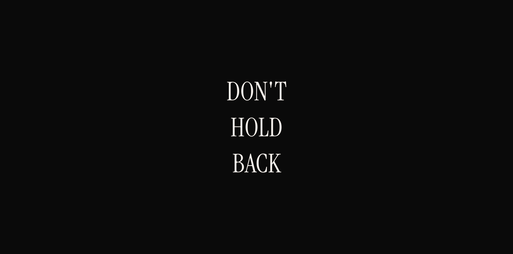
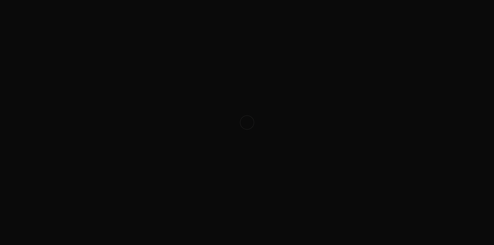

<p align="center">
  
</p>

<h1 align="center">
  DON'T HOLD BACK
</h1>

<p align="center">
  <em>A digital ritual. A breath you return to.</em>
</p>

<p align="center">
  <a href="https://dont-hold-back.vercel.app"><strong>dont-hold-back.vercel.app</strong></a>
</p>

<p align="center">
  
  
  
  
</p>

<br />

---

<br />

## What is this?


Some things you need to hear more than once.

**DON'T HOLD BACK** is a minimal, meditative web experience built around three words. It's not a website. It's not an app. It's a ritual — something you bookmark and reach for when you need a moment.

Press and hold. Breathe. Let the words appear.

<br />

## The Experience

```
                    ┌─────────────────────┐
                    │                     │
                    │                     │
                    │         ◯           │  ← You arrive. A ring pulses.
                    │                     │
                    │                     │
                    └─────────────────────┘
                              │
                         press & hold
                          2 seconds
                              │
                    ┌─────────────────────┐
                    │                     │
                    │       DON'T         │
                    │       HOLD          │  ← The words appear. A tone rings.
                    │       BACK          │
                    │                     │
                    └─────────────────────┘
                              │
                           breathe
```

The irony is intentional — you must *hold* to unlock *don't hold back*.

<p align="center">
  
  <br />
  <em>The void. A ring pulses. Waiting for you.</em>
</p>

<br />

## Three Reveal Modes

| Mode | Feel |
|------|------|
| **Ink Bleed** | Words bleed in like ink on paper — fuzzy edges settling to sharp |
| **Single Breath** | Everything fades in together, one slow inhale |
| **Vertical Cascade** | Words fall into place one by one, like a haiku read aloud |

Toggle between modes by hovering the bottom edge of the screen.

<br />

## Stack

| | |
|---|---|
| Framework | [RedwoodJS](https://redwoodjs.com) |
| Creative engine | [p5.js](https://p5js.org) (instance mode) |
| Animation | [GSAP](https://gsap.com) |
| Audio | Web Audio API (synthesized singing bowl) |
| Typography | [Instrument Serif](https://fonts.google.com/specimen/Instrument+Serif) |
| Export | Canvas API + MediaRecorder (1080x1920 for Instagram) |

<br />

## Run it

```bash
yarn install
yarn rw dev web
```

Open [http://localhost:8920](http://localhost:8920). Press and hold anywhere. Wait.

<br />

## Export

Hover the bottom edge to reveal controls:

- **PNG** — downloads a 1080x1920 still (Instagram Stories ready)
- **MP4** — records a 5-second breathing loop at 1080x1920

<br />

## Design Principles

- **Restraint over spectacle** — the emptiness is the message
- **Ritual over novelty** — same experience every visit, like a mantra
- **Breath over interaction** — after the reveal, the text simply lives

<br />

---

<p align="center">
  <em>Built with care by a human and an AI who didn't hold back.</em>
</p>
